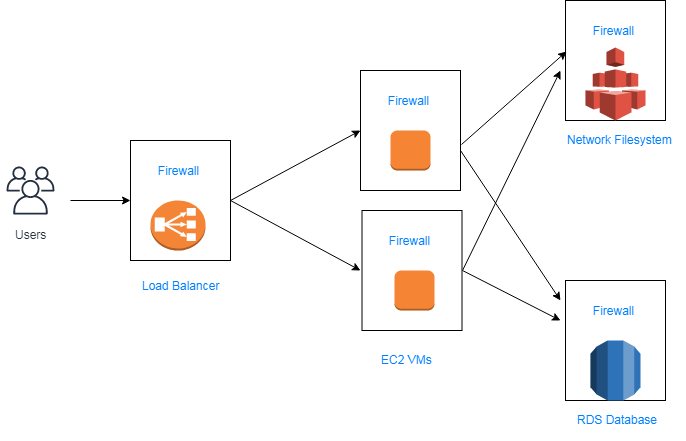

# AWS-EnterpriseBlogApplication
LAMP Stack based Blog web application for major Enterprise

Development of LAMP stack based blog web application which can handle more than 10,000 users simultaneously.

#### Services Used: ELB, EC2, RDS, EFS, Security Groups

The EFS is used to store files and access them from multiple virtual machines. 

Application Load Balancer is used which performs health checks to ensure requests are routed to healthy targets only.

